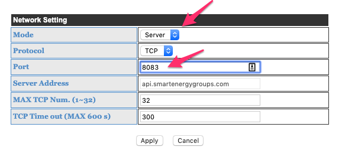
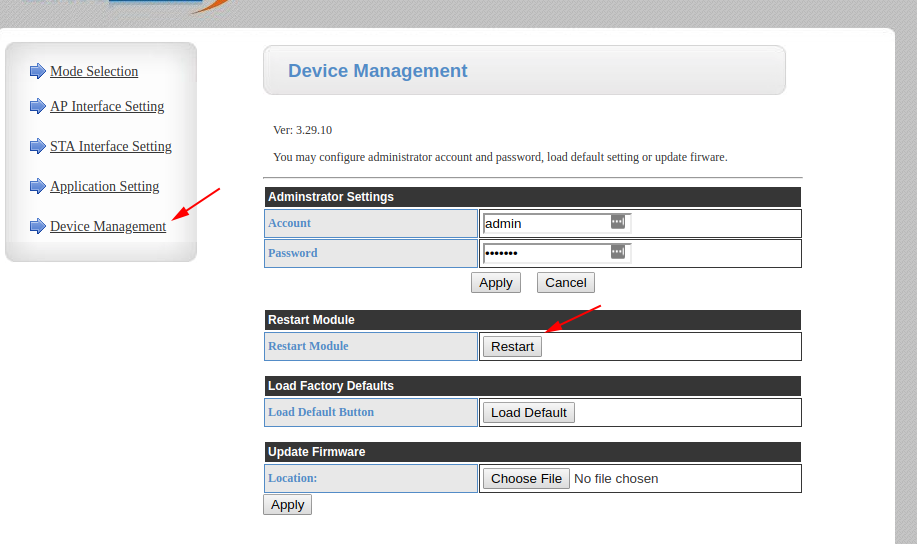

weepwr
======

Extensions to the weewx weather system for Brultech energy monitors.

### Configuring your Brultech device
The Brultech energy monitors come with a bewildering array of modes and options. To keep things
simple, this driver makes two assumptions:

- The device will always be in server mode.
- The device driver always polls the device.

This makes it pretty easy to configure the device:

1. Set the GEM to "server mode".
Using a browser, connect to your GEM (http://192.168.1.104, in my case) 
and go to the "Application Settings" page. 
Set it to server mode, using port 8083:

    

    Click Apply.
    
2. Then click on the "Device Management" tab, and click the "Restart" button under 
*Restart Module*.

    
    
The monitor will reboot and be ready to receive commands from the driver.
That's it for the monitor. Next step is to configure WeeWX.

## Manually configuring WeeWX

Unfortunately, at this point, there is no automatic installer for weepwr. Instead,
you will have to manually configure WeeWX.

### Copy files
Put the files `brultech.py` and `gem_schema.py` in the `user` subdirectory. Typically,

```shell script
cp bin/user/brultech.py /home/weewx/bin/user
cp bin/user/gem_schema.py /home/weewx/bin/user
```

Copy the `Power` skin over:
```shell script
cp -r skins/Power /home/weewx/skins
```

### Configure `weewx.conf`

This section is about manually configuring the configuration file, `weewx.conf`.

1. __Add section `[Brultech]`__

    Insert a new stanza `[Brultech]` into your `weewx.conf` file that looks like this:

    ```ini
    [Brultech]

        # See README.md for instructions on how to configure the Brultech devices!!
    
        # Power is computed as the difference between energy records. How old a 
        # record can be and still be used for this calculation:
        stale = 1800
    
        # How often to poll the device for data
        poll_interval = 5

        # Max number of channels to emit. Limit is set by hardware (48 for GEM).
        max_channels = 32
    
        # The type of packet to use. Possible choices are GEMBin48NetTime, GEMBin48Net,
        # or GEMAscii:
        packet_type = GEMBin48NetTime
    
        # Max number of times to try an I/O operation before declaring an error
        max_tries = 3
    
        driver = user.brultech

        # The type of connection to use. It should match a section below. 
        # Right now, only 'socket' is supported.
        connection = socket
    
        # The following is for socket connections: 
        [[socket]]
            host = 192.168.1.104
            port = 8083
            timeout = 20
            # After sending a command, how long to wait before looking for a response    
            send_delay = 0.2

        [[sensor_map]]
    ```

    Be sure to set options `host` and `port` to their proper values for your network configuration.

2. __Set station type__

    Tell WeeWX to use the Brultech device driver by setting `station_type`, 
under section `[Station]`, to `Brultech`:
 
     ```ini
    [Station]

        ...

        # Set to type of station hardware. There must be a corresponding stanza
        # in this file with a 'driver' parameter indicating the driver to be used.
        station_type = Brultech
    ```

3. __Configure new binding__

    Under stanza `[DataBindings]`, add a new database binding `bt_binding` for the Brultech device.
    It should look like this: 

    ```ini
   [DataBindings]

     ...

        [[bt_binding]]
            # The database must match one of the sections in [Databases].
            database = bt_sqlite
            # The name of the table within the database
            table_name = archive
            # The manager handles aggregation of data for historical summaries
            manager = weewx.manager.DaySummaryManager
            # The schema defines the structure of the database.
            # It is *only* used when the database is created.
            schema = user.gem_schema.schema
    ```

4. __Configure new database__

    Under stanza `[Databases]`, add a new database `bt_sqlite`:
    ```ini
    [Databases]
   
    ...
   
        [[bt_sqlite]]
            database_name = weepwr.sdb
            database_type = SQLite  
    ```
   
5. __Use the new binding__ 

    There are two places where the new binding must be specified: in `[StdArchive]` and
    in `[StdReport]`.
    
    Under stanza `[StdArchive]`, set the option `data_binding` to `bt_binding`:
    
    ```ini
    [StdArchive]

        ...
   
        data_binding = bt_binding         
   ```
   
   Under stanza `[StdReport]`, set the optoin `data_binding` to `bt_binding`:
   
    ```ini
   [StdReport]

        ...
   
        data_binding = bt_binding         
   ```
 
 6. __Activate the `Power` skin__
 
    Add a subsection to `[StdReport]` for the `Power` skin, and activate it by
    setting `enable` to `True`:
    
    ```ini
    [StdReport]
    
        ...
    
        [[PowerReport]]
            skin = Power
            enable = True
    ```
    Incidentally, while you're in there, you may want to deactive any "weather" skins
    you might have --- they won't work with the data from the energy monitor!
    
 7. __Make sure the configuration service runs__
 
     Because of its many specialized types, the Brultech driver requires setting up some custom
 configurations. This is done by the service `brultech.BrultechService`. You must
 add it to the list of services to run by adding it to `data_services`. So, now
 your `[Engine]` section looks something like this: 
 
     ```ini
     [Engine]
    
        [[Services]]
            # This section specifies the services that should be run. They are
            # grouped by type, and the order of services within each group
            # determines the order in which the services will be run.
            prep_services = weewx.engine.StdTimeSynch,
            data_services = user.brultech.BrultechService
            process_services = weewx.engine.StdConvert, weewx.engine.StdCalibrate, weewx.engine.StdQC, weewx.wxservices.StdWXCalculate
            ...
```